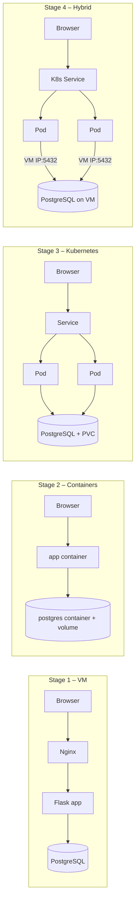

# Architecture

## Four models

```mermaid
flowchart LR
  subgraph S1[Stage 1 – VM]
    B1[Browser] --> N1[Nginx] --> A1[Flask app] --> D1[(PostgreSQL)]
  end
  subgraph S2[Stage 2 – Containers]
    B2[Browser] --> A2[app container] --> D2[(postgres container + volume)]
  end
  subgraph S3[Stage 3 – Kubernetes]
    B3[Browser] --> SV3[Service] --> P3a[Pod] & P3b[Pod]
    P3a & P3b --> D3[(PostgreSQL + PVC)]
  end
  subgraph S4[Stage 4 – Hybrid]
    B4[Browser] --> SV4[K8s Service] --> P4a[Pod] & P4b[Pod]
    P4a & P4b -- VM IP:5432 --> D4[(PostgreSQL on VM)]
  end
```

_Replace with the final diagram used in the report and presentation._
